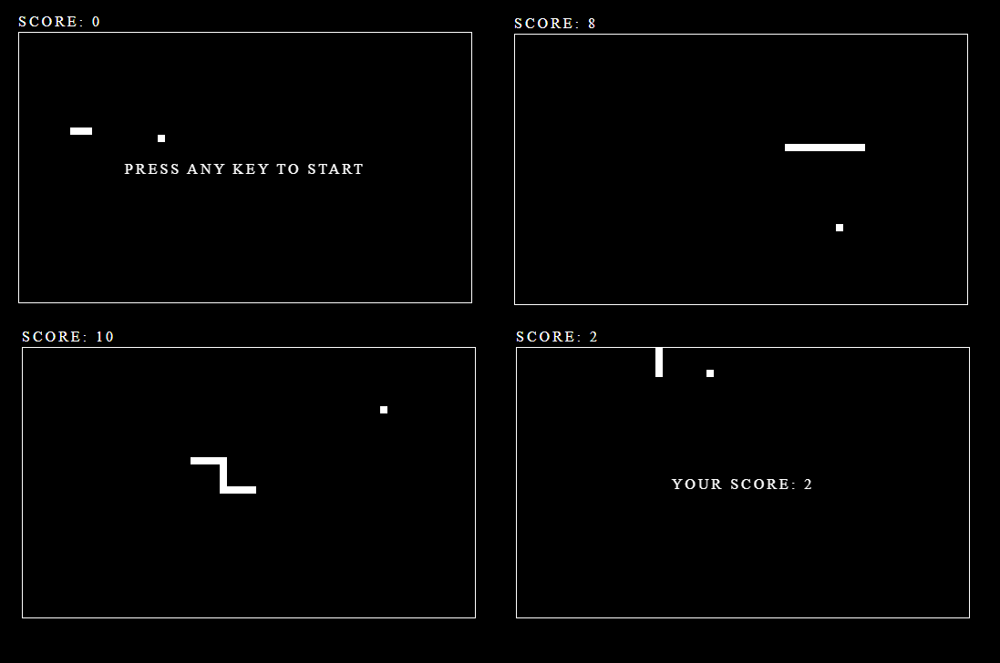

# Snake

Snake is the common name for a video game concept where the player maneuvers a line which grows in length, with the line itself being a primary obstacle.



### Installing

Clone Git repository

```
git clone https://github.com/ekalksma/snake.git
```

Open public/index.html in your browser.

## License

This project is licensed under the [MIT License](./LICENSE).
